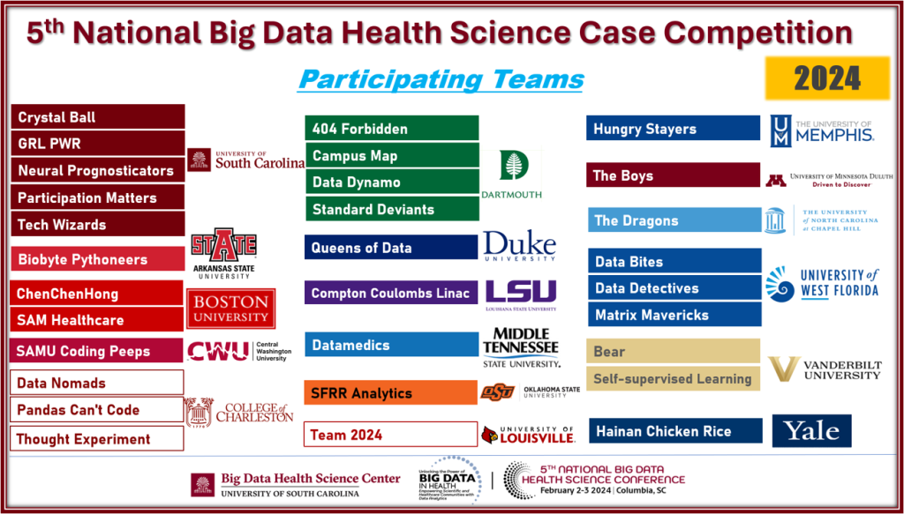
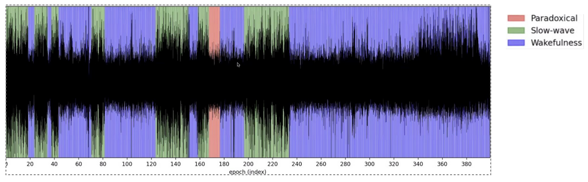

I have always loved participating in hackathons as they give you a chance to apply your knowledge to solve real-world problems. This year, I got the opportunity to participate in the [5th National Big Data Health Science Student Case Competition](https://bigdata.sc.edu/about/). It's an annual event organized by USC to promote the use of Big Data analytics in healthcare research (Spoiler Alert: We won!).

The hackathon spans 48 hours and is divided into two stages. The first stage is a qualifying round for the finals. Around 30 teams from 17 universities, including Duke, Yale, and Boston University, participated. The data came from the lab work of Drs. Ana Pocivavsek and Snezana Milosavljevic. In Round 1, we had to **develop a method to classify unlabeled EEG sleep data from small rodents into three states: paradoxical sleep, slow-wave sleep, or wakefulness.**.The final round focused on addressing chronic sleep disorders by deploying a machine learning model, emphasizing the reliability and deployment readiness of our first-round model. Our team name was Neural Prognosticators (sounds cool, right?).

With only 17 hours to build a model and create a presentation for the first round, I knew sleep was off the table. The dataset, EEG data collected from rodents over two days, was massive—about 10GB! Handling such a large dataset was a first for me, and loading it on my local machine was a struggle. I decided to load the data in batches and perform exploratory data analysis (EDA) and preprocessing.

The data given to us was broadly classified into three stages of sleep:
    Paradoxical sleep: REM stage with rapid eye movements and vivid dreaming; crucial for cognitive functions like memory consolidation.
    Slow-wave sleep: Deep sleep stage characterized by slow delta waves; vital for physical restoration and recovery.
    Wakefulness: Fully awake and alert; brain active, conscious of surroundings.

Initial analysis revealed a class imbalance between paradoxical sleep and the other stages. A good classification model must handle all labels without bias, so I knew this was a problem to solve. Time for some feature engineering! Drawing on my physics background, I added features such as:
1. <b>Power Spectral Density (PSD) </b>​: EEG signals can be classified based on their frequency content. The frequncey components of these singals can be used to classifiy them into the following bands.
     * Delta (0.5-4 Hz): Delta waves are usually associated with deep sleep ​
     * Theta (4-8 Hz): Theta waves are often observed during drowsiness or light sleep. ​
     * Alpha (8-13 Hz): Alpha waves are prominent when an individual is awake but relaxed.​
     * Beta (13-30 Hz): Beta waves are associated with active and alert mental activity.​
     * Gamma (30-100 Hz and above): Gamma waves are associated with high-level cognitive processes
2. <b>Maximum Minimum Distance (MMD)</b>​: ​ TMeasures the distance between the maximum and minimum points (amplitude) in each epoch.
3. <b>Hjorth parameters​</b>​: Characterize the signal's activity, mobility, and complexity.
4. <b>Shannon entropy</b>​​: Quantifies the information content or unpredictability of a signal.
   
Next, I experimented with different models. With labeled data, it was a typical supervised learning problem. The challenge was whether to use the entire dataset, which would increase training time, or sample from it for initial comparisons. With only 12 hours left, I opted to sample 30% of the data to test models like LSTM, Random Forest, and Gradient Boosting (XGBoost, LightGBM). The LSTM and XGBoost models performed best. To address class imbalance, I used methods like SMOTE and balanced sampling. After training on the entire dataset (~70%), XGBoost outperformed LSTM in both accuracy and F1 score. With just 4 hours left, I focused on creating our presentation deck. You can check it out [here](https://docs.google.com/presentation/d/1MbHzhTogJosec2Jt0jlLzf8lzIGcn9WX/edit?usp=sharing&ouid=111199971333324653064&rtpof=true&sd=true). Confident in our results, I continued refining the model instead of sleeping. We made it to the finals! 

For the final round, I added more features, fine-tuned hyperparameters, and created an ensemble of the top models. We also had to measure our models' reliability, a challenge in itself. Without any sleep, I updated our final deck and model iterations just an hour before the deadline. The last 34 hours were the most productive of my life, no doubt. When the results were announced, my anxiety turned into relief and excitement as we were declared [winners](https://bigdata.sc.edu/5th-national-bdhs-case-competition/). We won $5k, which was pretty cool too. This hackathon was an incredible journey, from almost not participating to winning. It was quite an adventure!
